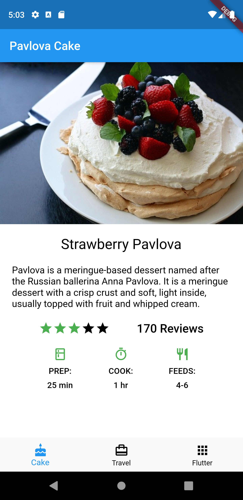
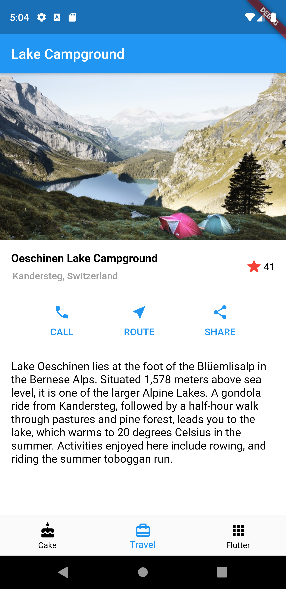

# Practise app

It is based on Flutter UI documentation/tutorial. 
Reference: https://flutter.dev/docs/development/ui/layout

App has 3 tabs.
First tab shows Pavlova cake recipe.
Screen tab shows information about 'Oeschinen Lake Campground' in Switzerland.
Third tab has flutter logo animation.

#### Screenshots:
 &nbsp;&nbsp;&nbsp; 
